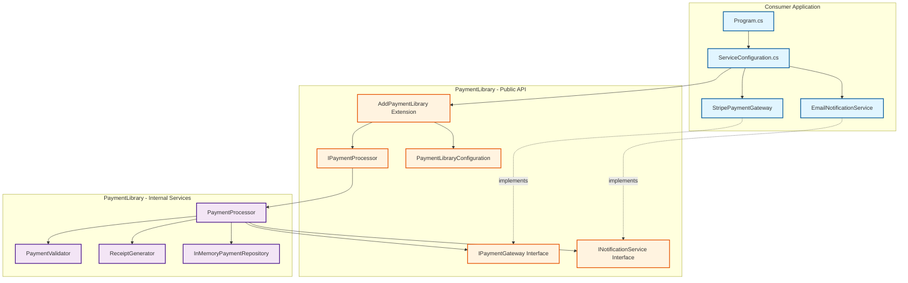
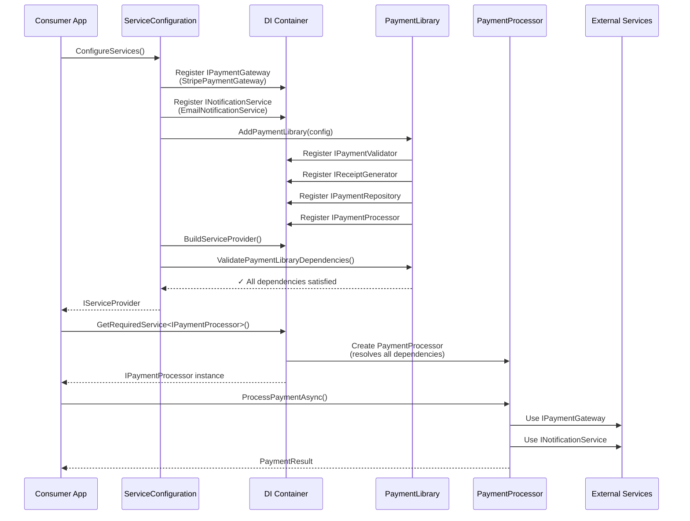

# Payment Library - Dependency Injection Container Pattern

A demonstration of how to build a reusable library with an encapsulated DI container that manages internal dependencies while requiring consumers to provide external integrations.

## 📋 Table of Contents

- [Overview](#overview)
- [Architecture](#architecture)
- [Dependency Graph](#dependency-graph)
- [Project Structure](#project-structure)
- [Getting Started](#getting-started)
- [Usage](#usage)
- [Configuration](#configuration)
- [Extending the Library](#extending-the-library)
- [Best Practices](#best-practices)

## Overview

This project demonstrates a clean architecture pattern for building reusable libraries with dependency injection. The key concept is:

- **Library manages its own internal dependencies** - Consumers don't need to know about internal implementation details
- **Library requires external dependencies** - Consumers provide integrations (payment gateway, notifications)
- **Clean separation of concerns** - Internal services are hidden, only necessary interfaces are exposed

### Key Benefits

✅ **Encapsulation** - Internal dependencies are hidden from consumers  
✅ **Flexibility** - Consumers can provide their own implementations  
✅ **Testability** - Easy to mock external dependencies  
✅ **Maintainability** - Library can change internals without affecting consumers  
✅ **Type Safety** - Compile-time validation of dependencies  

## Architecture

### Library Responsibilities

The **PaymentLibrary** handles:
- Payment validation logic
- Receipt generation
- Payment record storage
- Orchestration of payment flow

### Consumer Responsibilities

The **ConsumerApp** must provide:
- Payment gateway implementation (Stripe, PayPal, etc.)
- Notification service implementation (Email, SMS, etc.)
- Configuration values

## Dependency Graph

### Dependency Flow

## Project Structure
```

Solution/
│
├── PaymentLibrary/                      # The reusable library
│   ├── External/                        # Interfaces consumer must implement
│   │   ├── IPaymentGateway.cs          # Payment gateway abstraction
│   │   └── INotificationService.cs     # Notification abstraction
│   │
│   ├── Services/                        # Internal + Public services
│   │   ├── IPaymentProcessor.cs        # PUBLIC: Main service interface
│   │   ├── PaymentProcessor.cs         # Internal implementation
│   │   ├── IPaymentValidator.cs        # Internal interface
│   │   ├── PaymentValidator.cs         # Internal implementation
│   │   ├── IReceiptGenerator.cs        # Internal interface
│   │   └── ReceiptGenerator.cs         # Internal implementation
│   │
│   ├── Repositories/                    # Data access layer
│   │   ├── IPaymentRepository.cs       # Internal interface
│   │   └── InMemoryPaymentRepository.cs # Internal implementation
│   │
│   ├── Models/                          # Data models
│   │   ├── PaymentRequest.cs
│   │   ├── PaymentResult.cs
│   │   └── Receipt.cs
│   │
│   ├── Configuration/                   # DI setup
│   │   ├── PaymentLibraryConfiguration.cs
│   │   └── PaymentLibraryServiceCollectionExtensions.cs
│   │
│   └── PaymentLibrary.csproj
│
└── ConsumerApp/                         # Example consumer application
├── ExternalServices/                # Consumer's implementations
│   ├── StripePaymentGateway.cs     # Stripe integration
│   └── EmailNotificationService.cs  # Email integration
│
├── ServiceConfiguration.cs          # DI composition root
├── Program.cs                       # Application entry point
└── ConsumerApp.csproj
```
## Getting Started

### Prerequisites

- .NET 6.0 SDK or later
- Any IDE supporting C# (Visual Studio, Rider, VS Code)

### Installation

1. **Clone the repository**
   ```bash
   git clone <repository-url>
   cd payment-library-demo
   ```

2. **Restore dependencies**
   ```bash
   dotnet restore
   ```

3. **Build the solution**
   ```bash
   dotnet build
   ```

4. **Run the consumer application**
   ```bash
   dotnet run --project ConsumerApp
   ```

## Usage

### Step 1: Implement External Dependencies

The library requires two external dependencies. Implement them in your consumer application:
```csharp
// Implement IPaymentGateway for your payment provider
public class StripePaymentGateway : IPaymentGateway
{
    public async Task<PaymentGatewayResponse> ProcessPaymentAsync(
        decimal amount, string currency, string token)
    {
        // Your Stripe integration here
        // Call Stripe API, handle responses, etc.
    }
}

// Implement INotificationService for your notification system
public class EmailNotificationService : INotificationService
{
    public async Task SendNotificationAsync(
        string recipient, string subject, string message)
    {
        // Your email service integration here
        // Send via SendGrid, SMTP, etc.
    }
}
```
### Step 2: Configure Services

Create a `ServiceConfiguration.cs` to set up all dependencies:
```csharp
public static class ServiceConfiguration
{
    public static IServiceProvider ConfigureServices()
    {
        var services = new ServiceCollection();

        // 1. Register YOUR implementations of external dependencies
        RegisterExternalDependencies(services);

        // 2. Register the Payment Library
        RegisterPaymentLibrary(services);

        // 3. Build and validate
        var serviceProvider = services.BuildServiceProvider();
        ValidateDependencies(serviceProvider);

        return serviceProvider;
    }

    private static void RegisterExternalDependencies(IServiceCollection services)
    {
        services.AddSingleton<IPaymentGateway, StripePaymentGateway>();
        services.AddSingleton<INotificationService, EmailNotificationService>();
    }

    private static void RegisterPaymentLibrary(IServiceCollection services)
    {
        services.AddPaymentLibrary(config =>
        {
            config.EnableNotifications = true;
            config.MaxRetryAttempts = 3;
            config.DefaultCurrency = "EUR";
        });
    }

    private static void ValidateDependencies(IServiceProvider serviceProvider)
    {
        // This will throw if external dependencies are missing
        serviceProvider.ValidatePaymentLibraryDependencies();
    }
}
```
### Step 3: Use the Library
```csharp
class Program
{
    static async Task Main(string[] args)
    {
        // Configure all dependencies
        var serviceProvider = ServiceConfiguration.ConfigureServices();

        // Get the payment processor
        var paymentProcessor = serviceProvider
            .GetRequiredService<IPaymentProcessor>();

        // Use it!
        var request = new PaymentRequest
        {
            UserId = "user_123",
            UserEmail = "user@example.com",
            Amount = 99.99m,
            Currency = "USD",
            PaymentToken = "tok_visa_4242",
            Description = "Premium Subscription"
        };

        var result = await paymentProcessor.ProcessPaymentAsync(request);

        if (result.Success)
        {
            Console.WriteLine($"Payment successful! ID: {result.PaymentId}");
            Console.WriteLine(result.Receipt.FormattedReceipt);
        }
        else
        {
            Console.WriteLine($"Payment failed: {result.ErrorMessage}");
        }
    }
}
```
## Configuration

### Library Configuration Options
```csharp
public class PaymentLibraryConfiguration
{
    // Enable/disable notification sending
    public bool EnableNotifications { get; set; } = true;

    // Maximum retry attempts for failed operations
    public int MaxRetryAttempts { get; set; } = 3;

    // Default currency if not specified in request
    public string DefaultCurrency { get; set; } = "USD";
}
```
### Configuration Examples

**Basic configuration:**
```csharp
services.AddPaymentLibrary(config =>
{
    config.EnableNotifications = true;
    config.DefaultCurrency = "USD";
});
```
**Production configuration:**
```csharp
services.AddPaymentLibrary(config =>
{
    config.EnableNotifications = true;
    config.MaxRetryAttempts = 5;
    config.DefaultCurrency = "EUR";
});
```
**Testing configuration:**
```csharp
services.AddPaymentLibrary(config =>
{
    config.EnableNotifications = false; // Don't send emails in tests
    config.MaxRetryAttempts = 1;
});
```
## Extending the Library

### Adding New Internal Services

Internal services are automatically managed by the library. Just add them to the registration:
```csharp
// In PaymentLibraryServiceCollectionExtensions.cs
public static IServiceCollection AddPaymentLibrary(...)
{
    // ... existing registrations ...
    
    // Add your new internal service
    services.AddTransient<INewInternalService, NewInternalService>();
    
    return services;
}
```
### Adding New External Dependencies

1. **Define the interface** in `PaymentLibrary/External/`:
   ```csharp
   public interface INewExternalService
   {
       Task DoSomethingAsync();
   }
   ```

2. **Update validation** in `PaymentLibraryServiceCollectionExtensions.cs`:
   ```csharp
   public static void ValidatePaymentLibraryDependencies(
       this IServiceProvider serviceProvider)
   {
       // ... existing validations ...
       
       var newService = serviceProvider.GetService<INewExternalService>();
       if (newService == null)
       {
           throw new InvalidOperationException(
               "INewExternalService must be registered.");
       }
   }
   ```

3. **Consumer implements it**:
   ```csharp
   public class MyNewService : INewExternalService
   {
       public async Task DoSomethingAsync()
       {
           // Implementation
       }
   }
   
   // Register it
   services.AddSingleton<INewExternalService, MyNewService>();
   ```

## Best Practices

### ✅ DO

- **Use internal keyword** for services that consumers shouldn't see
- **Validate dependencies** early in the application lifecycle
- **Provide meaningful configuration options** with sensible defaults
- **Use extension methods** following .NET conventions (e.g., `AddPaymentLibrary`)
- **Document external dependencies** clearly in XML comments
- **Separate concerns** - one class, one responsibility
- **Use interfaces** for all services to enable testing

### ❌ DON'T

- **Don't expose internal implementations** as public
- **Don't force consumers** to register internal dependencies
- **Don't use service locator pattern** - use constructor injection
- **Don't create static dependencies** - everything should be injectable
- **Don't skip validation** - fail fast if dependencies are missing

### Testing Strategies

**Testing the library:**
```csharp
[Test]
public async Task ProcessPayment_Success_ReturnsValidResult()
{
    // Arrange
    var mockGateway = new Mock<IPaymentGateway>();
    var mockNotification = new Mock<INotificationService>();
    // ... setup mocks ...

    var processor = new PaymentProcessor(
        mockGateway.Object,
        mockNotification.Object,
        validator,
        receiptGenerator,
        repository);

    // Act
    var result = await processor.ProcessPaymentAsync(request);

    // Assert
    Assert.IsTrue(result.Success);
}
```
**Testing the consumer:**
```csharp
[Test]
public async Task ConsumerApp_CanResolveAllDependencies()
{
    // Arrange
    var serviceProvider = ServiceConfiguration.ConfigureServices();

    // Act & Assert
    Assert.DoesNotThrow(() => 
        serviceProvider.ValidatePaymentLibraryDependencies());
    
    var processor = serviceProvider
        .GetRequiredService<IPaymentProcessor>();
    
    Assert.IsNotNull(processor);
}
```
## Key Patterns Demonstrated

### 1. Composition Root Pattern
All dependency registration happens in one place (`ServiceConfiguration.cs`), making it easy to understand and modify the application's object graph.

### 2. Extension Method Pattern
Clean, fluent API for library registration:
```csharp
services.AddPaymentLibrary(config => { ... })
```
### 3. Dependency Inversion Principle
High-level modules (PaymentProcessor) depend on abstractions (IPaymentGateway), not concrete implementations.

### 4. Encapsulation
Internal services are hidden from consumers using the `internal` keyword and separate namespaces.

### 5. Builder/Options Pattern
Configuration is passed via strongly-typed options object with lambda configuration.

## Troubleshooting

### Error: "PaymentLibrary requires IPaymentGateway to be registered"

**Cause:** You forgot to register an implementation of `IPaymentGateway`.

**Solution:** Add before calling `AddPaymentLibrary()`:
```csharp
services.AddSingleton<IPaymentGateway, YourPaymentGatewayImpl>();
```
### Error: "Unable to resolve service for type 'IPaymentProcessor'"

**Cause:** Library not registered or registered after `BuildServiceProvider()`.

**Solution:** Ensure `services.AddPaymentLibrary(...)` is called before building the provider.

---

## License

This is a demonstration project. Use it as a template for your own libraries.

## Contributing

This is an educational example. Feel free to fork and modify for your needs!

## Questions?

For questions about this pattern, please refer to:
- [Microsoft DI Documentation](https://learn.microsoft.com/en-us/dotnet/core/extensions/dependency-injection)
- [Dependency Inversion Principle](https://en.wikipedia.org/wiki/Dependency_inversion_principle)